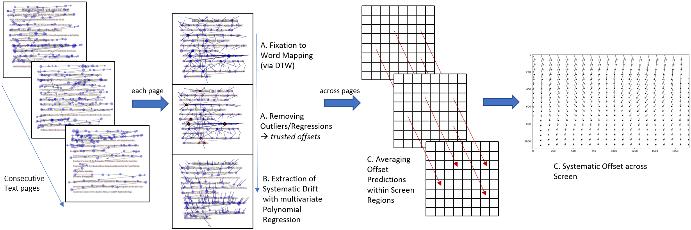
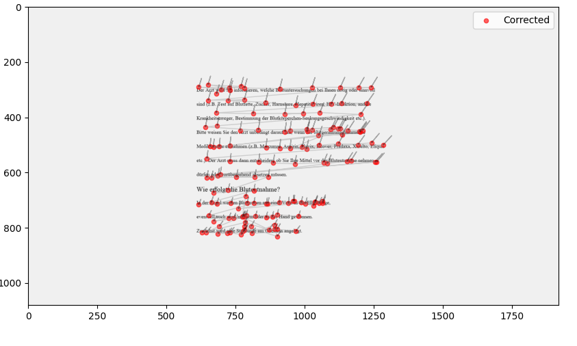

# Systematic Drift Correction in Eye Tracking Reading Studies: Integrating Line Assignments with Implicit Recalibration

This repository contains the Python code to implement the drift correction approach for eye tracking reading studies as described in the paper/preprint listed below.




This approach is designed to extract the systematic error across multiple consecutive reading trials in an eye-tracking study. It utilizes a trial-by-trial fixation-to-word mapping for multi-line text, employing a line assignment algorithm based on dynamic time warping. After this initial step, the method involves extracting systematic drift through spatial and temporal filtering to mitigate artificial noise.

Please note that this approach does not result in a final fixation-to-word assignment. For this, you might want to perform an assignment algorithm afterwards; for example, see https://github.com/jwcarr/drift for further guidance.

For further details, please refer to the referenced paper or contact me directly at: wolf.culemann@uni-due.de


## Example

This repository includes data from 3 subjects for demonstration purposes. To run the demo, execute the following command:

```shell
python demo.py

```

If you wish to visualize the corrected fixations, adjust the show_n_trials_per_subject setting in the configuration to a number greater than 0.




## Citation

If you use this approach, please cite the following preprint:

Culemann, W., Neuber, L., & Heine, A. (2024). Systematic Drift Correction in Eye Tracking Reading Studies: Integrating Line Assignments with Implicit Recalibration (No. 13293). EasyChair. https://easychair.org/publications/preprint/gLt7

```bibtex
@techreport{culemann2024systematic,
  title={Systematic Drift Correction in Eye Tracking Reading Studies: Integrating Line Assignments with Implicit Recalibration},
  author={Culemann, Wolf and Neuber, Leana and Heine, Angela},
  year={2024},
  institution={EasyChair}
}
```
